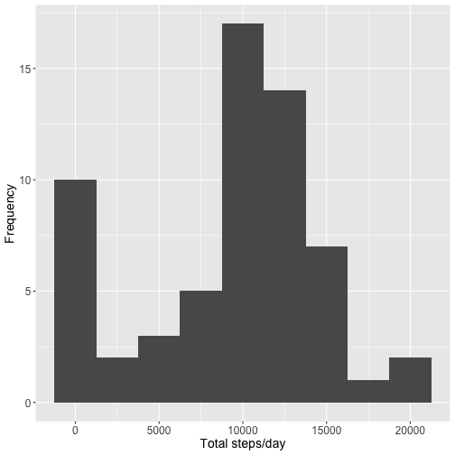
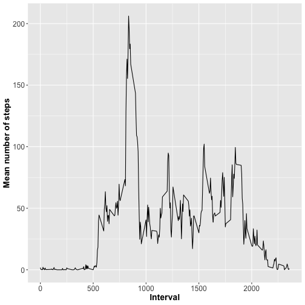
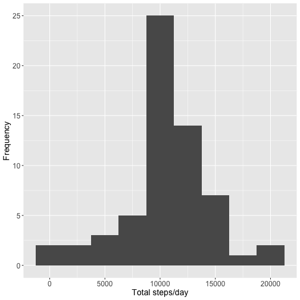
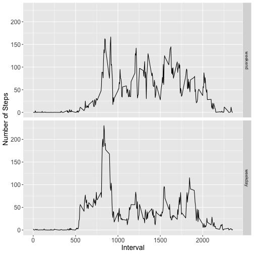

```r
temp <- tempfile()
download.file("https://d396qusza40orc.cloudfront.net/repdata%2Fdata%2Factivity.zip", temp, mode="wb", method="curl")
unzip(temp, "activity.csv")
activity <- read.table("activity.csv", sep=",", header=T)
activity$date <- as.Date(activity$date, "%Y-%m-%d")

##1. number of steps taken per day
library (dplyr)
AvgDay <- activity %>% group_by(date) %>%
          summarize(total.steps = sum(steps, na.rm = T), 
                  mean.steps = mean(steps, na.rm = T))
library(ggplot2)
g <- ggplot(AvgDay, aes(x=total.steps))
g + geom_histogram(binwidth = 2500) + theme(axis.text = element_text(size = 12),  
      axis.title = element_text(size = 14)) + labs(y = "Frequency") + labs(x = "Total steps/day")
```



```r
summary(AvgDay$total.steps)
```

```
##    Min. 1st Qu.  Median    Mean 3rd Qu.    Max. 
##       0    6778   10395    9354   12811   21194
```

```r
summary (AvgDay$mean.steps)
```

```
##    Min. 1st Qu.  Median    Mean 3rd Qu.    Max.    NA's 
##  0.1424 30.6979 37.3785 37.3826 46.1597 73.5903       8
```

```r
##2. Daily activity pattern??
AvgInterval <- activity %>% group_by(interval) %>%
      summarize(mean.steps = mean(steps, na.rm = T))
g <- ggplot(AvgInterval, aes(x = interval, y = mean.steps))
g + geom_line() + theme(axis.text = element_text(size = 12), 
      axis.title = element_text(size = 14, face = "bold")) + 
      labs(y = "Mean number of steps") + labs(x = "Interval")
```



```r
##3. Imputing missing values
mean(is.na(activity$steps))
```

```
## [1] 0.1311475
```

```r
sum(is.na(activity$steps))
```

```
## [1] 2304
```

```r
sum(is.na(AvgInterval$mean.steps))
```

```
## [1] 0
```

```r
newData <- activity

for (i in 1:nrow(newData)) {
      if (is.na(newData$steps[i])) {
            index <- newData$interval[i]
            value <- subset(AvgInterval, interval==index)
            newData$steps[i] <- value$mean.steps
      }
}
head(newData)
newAvg <- newData %>% group_by(date) %>%
      summarize(total.steps = sum(steps, na.rm = T))
g <- ggplot(newAvg, aes(x=total.steps))
g + geom_histogram(binwidth = 2500) + theme(axis.text = element_text(size = 12),
      axis.title = element_text(size = 14)) + labs(y = "Frequency") + labs(x = "Total steps/day")
```



```r
summary (AvgDay$total.steps)
```

```
##    Min. 1st Qu.  Median    Mean 3rd Qu.    Max. 
##       0    6778   10395    9354   12811   21194
```

```r
sd(AvgDay$total.steps, na.rm=T)
```

```
## [1] 5405.895
```

```r
summary (newAvg$total.steps)
```

```
##    Min. 1st Qu.  Median    Mean 3rd Qu.    Max. 
##      41    9819   10766   10766   12811   21194
```

```r
sd(newAvg$total.steps, na.rm=T)
```

```
## [1] 3974.391
```

```r
##4. differences in activity patterns
newData$day <- ifelse(weekdays(newData$date) %in% c("Saturday", "Sunday"), "weekend", "weekday")
wkend <- filter(newData, day == "weekend")
wkday <- filter(newData, day == "weekday")
wkend <- wkend %>%
      group_by(interval) %>%
      summarize(mean.steps = mean(steps)) 
wkend$day <- "weekend"

wkday <- wkday %>%
      group_by(interval) %>%
      summarize(mean.steps = mean(steps)) 
wkday$day <- "weekday"

newInterval <- rbind(wkend, wkday)
newInterval$day <- as.factor(newInterval$day)
newInterval$day <- relevel(newInterval$day, "weekend")

g <- ggplot (newInterval, aes (interval, mean.steps))
g + geom_line() + facet_grid (day~.) + theme(axis.text = element_text(size = 12), 
      axis.title = element_text(size = 14)) + labs(y = "Number of Steps") + labs(x = "Interval")
```


$ git init
$ git add .
$ git commit -m "Reproducible-Research"
